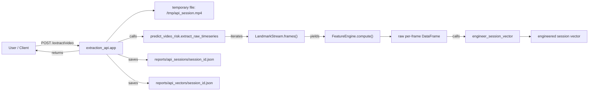
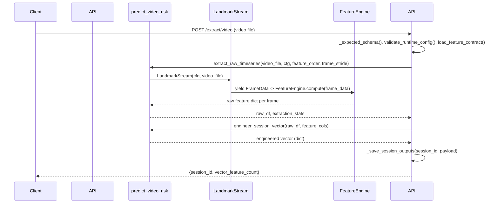

# Face Feature Extraction — End-to-End Workflow (Function-Level)

This document explains the runtime pipeline, the data flow, and the exact function call graph for the `face_feature_extraction_api` project. It is written for a developer who does not yet know the codebase. All functions below use Python and the names/signatures match the code.

----

## Quick summary
- Entrypoint: `uvicorn app:app` or run `python app.py` (app imports the FastAPI `app` instance from `extraction_api.py`).
- Public UI: Swagger at `/docs` (interactive API explorer).
- Core flow (high level): HTTP upload → save temporary video → extract per-frame raw features → engineer session vector → save session artifacts and vector → return session id.

----

## Start the server (what runs first)
1. `app.py` (very small): imports the FastAPI instance.
   - File: [app.py](app.py)
   - Effect: `from extraction_api import app` — this causes `extraction_api.py` to run at import-time (modules and app object are created).

2. `extraction_api.py` module import-time actions
   - Loads environment variables via `load_dotenv(project_root / ".env")`.
   - Calls `_load_api_key()` once to validate `EXTRACTION_API_KEY` (fail-fast if missing or placeholder).
   - Registers FastAPI `app` object and custom OpenAPI function `custom_openapi()`.

Run (example):
```bash
uvicorn app:app --host 0.0.0.0 --port 5100 --reload
```

----

## Interactive UI for testing
- After starting the server, open: `http://127.0.0.1:5100/docs` (or replace port with configured port).
- Click **Authorize** and enter your `X-API-Key` (same name as in `.env`).
- Use `POST /extract/video` to upload a `multipart/form-data` video file and receive a `session_id`.
- Use `GET /extract/session/{session_id}/vector` to fetch the saved engineered vector.

----

## High-level data flow (Mermaid flowchart)


----

## Sequence diagram (main call sequence)


----

## Detailed function reference (call graph + signature + language + purpose)
All signatures are shown as they appear in code; language: Python.

### Top-level API module: `extraction_api.py`
- _Working:_ HTTP layer, authentication, request validation, orchestration of extraction.

- `def _load_api_key() -> str` (Python)
  - Purpose: Read `EXTRACTION_API_KEY` from environment; fail startup if missing or placeholder.
  - Called at import-time by module to set `EXPECTED_API_KEY`.

- `def require_api_key(provided_key: str | None = Depends(api_key_header)) -> None` (Python)
  - Purpose: FastAPI dependency to validate incoming `X-API-Key` header.
  - Called by FastAPI on protected endpoints (via `Depends(require_api_key)`).

- `def custom_openapi()` (Python)
  - Purpose: Inject `apiKey` security scheme into OpenAPI spec so Swagger UI shows **Authorize**.
  - Registered as `app.openapi`.

- `def _expected_schema(model_dir: Path, training_report: str, label_col: str) -> tuple[list[str], Path]` (Python)
  - Purpose: Resolve expected model input schema by consulting `training_report.json` (via `predict_video_risk.resolve_expected_feature_order`).
  - Called by `extract_from_video` before engineering the session vector.

- `def _save_session_outputs(session_id: str, payload: Dict[str, Any]) -> None` (Python)
  - Purpose: Persist full session JSON and vector-only JSON to `reports/api_sessions` and `reports/api_vectors`.
  - Called by `extract_from_video` after vector is engineered.

- `async def extract_from_video(video: UploadFile = File(...), ..., _auth: None = Depends(require_api_key)) -> Dict[str, Any]` (Python)
  - Purpose: Main API endpoint for a video upload. Orchestrates temp-file creation, calls extraction routines, validates duration, builds final payload, saves artifacts, and returns `session_id`.
  - Key calls inside:
    - `validate_runtime_config(cfg)` (src.config)
    - `validate_runtime_contract()` (src.regions)
    - `load_feature_contract(project_root)` (src.contracts)
    - `predict_video_risk.extract_raw_timeseries(...)`
    - `predict_video_risk.engineer_session_vector(...)`
    - `_save_session_outputs(...)`

- `def get_session_vector(session_id: str, _auth: None = Depends(require_api_key)) -> Dict[str, Any]` (Python)
  - Purpose: Retrieve previously saved vector payload for a session.

### Predict & engineering module: `predict_video_risk.py`
- _Working:_ Contains the non-API command-line oriented pipeline pieces used by the API orchestration.

- `def _build_engine_cfg(cfg: RuntimeConfig) -> FeatureEngineConfig` (Python)
  - Purpose: Convert `RuntimeConfig` thresholds into a `FeatureEngineConfig` instance for the feature engine.
  - Called by `extract_raw_timeseries` to configure `FeatureEngine`.

- `def extract_raw_timeseries(video_file: Path, cfg: RuntimeConfig, feature_order: List[str], frame_stride: int) -> Tuple[pd.DataFrame, Dict[str, int]]` (Python)
  - Purpose: Open the video with `LandmarkStream`, iterate frames with sampling (`frame_stride`), compute per-frame raw features using `FeatureEngine.compute`, and aggregate into a `pandas.DataFrame` + stats.
  - Calls: `FeatureEngine(...)`, `LandmarkStream(...)`, `engine.compute(frame_data)`.

- `def engineer_session_vector(raw_df: pd.DataFrame, feature_cols: List[str]) -> Dict[str, float]` (Python)
  - Purpose: Aggregate per-frame raw features into session-level engineered features (mean, std, min, max, range, slope) for every base feature column.
  - Called by API after `extract_raw_timeseries` returns the raw DataFrame.

- `def resolve_expected_feature_order(project_root: Path, training_report_path: Path, label_col: str) -> Tuple[List[str], Path, List[str]]` (Python)
  - Purpose: Determine expected model features in order, reading training report artifacts or training CSV header as fallback.
  - Called by `_expected_schema`.

### Landmark ingestion: `src/landmark_stream.py`
- _Working:_ Responsible for capturing frames (webcam or video), running MediaPipe face mesh, and yielding timestamped landmarks.

- `class LandmarkStream` (Python)
  - `def __enter__(self) -> LandmarkStream` — opens video/camera and MediaPipe FaceMesh.
  - `def __exit__(self, exc_type, exc, tb) -> None` — closes resources.
  - `def frames(self) -> Generator[Tuple[FrameData, object], None, None]` — yields `(FrameData, BGR frame)` for each frame that successfully includes a face; uses deterministic video timestamps for files.
  - `@staticmethod def _extract_landmark_tuples(face_landmarks) -> List[LandmarkPoint]` — converts MediaPipe landmark objects to (x,y,z) tuples.

### Raw feature computation: `src/feature_engine.py`
- _Working:_ Stateful per-frame raw feature generator. Outputs raw values for each contracted feature name.

- Key elements:
  - `class FeatureEngineConfig` — dataclass describing thresholds and smoothing windows.
  - `class FeatureEngineState` — internal state and event buffers used across frames.
  - `class FeatureEngine`:
    - `def __init__(self, feature_order: Sequence[str], cfg: FeatureEngineConfig) -> None` — preps smoothing buffers and state.
    - `def compute(self, frame_data: FrameData) -> FeatureDict` — main per-frame method. Steps:
      1. `extract_regions(frame_data.landmarks, strict=True)` — map global landmarks to semantic regions.
      2. Compute geometric primitives (lip corners, iris centroids, head/nose points).
      3. Event detection: smile onsets, blink detection, gaze shifts, lip compression, nods, etc.
      4. Build `features` dictionary of raw feature values (e.g., `au12_mean_amplitude`, `blink_rate`, `eye_contact_ratio`).
      5. Smooth per-feature values with `_smooth` and return final map.

  - Helper functions in this module (private): `_distance`, `_distance_xy`, `_centroid`, `_ear`, `_event_rate`, `_safe_mean`, `_safe_variance` — used inside `FeatureEngine.compute()`.

### Regions & contract: `src/regions.py`
- _Working:_ Defines the frozen region-to-landmark mapping and helpers to extract region point lists from the full landmark array.
- Important functions:
  - `def validate_runtime_contract() -> RegionValidationReport` — validated at import time to fail-fast on mapping errors.
  - `def extract_regions(landmarks, region_names=None, *, strict=True) -> Dict[str, List[LandmarkPoint]]` — returns semantic regions used by `FeatureEngine`.
  - `def get_region_points(landmarks, region_name, *, strict=True) -> List[LandmarkPoint]` — lower-level extractor.
  - `def flatten_region_ids(mapping=None) -> List[int]` — returns unique list of landmark indices used across regions.

### Contracts & config (where the feature list is read)
- `src/contracts.py` exposes `load_feature_contract(project_root)` which returns an object including `feature_order` used throughout the pipeline. This is consulted by `extract_from_video` and `extract_raw_timeseries`.
- `src/config.py` defines `RuntimeConfig` and `validate_runtime_config()` used to read runtime parameters (smoothing windows, thresholds, FPS, camera settings).

----

## Data artifacts and where they are written
- Temporary uploaded video: created in system temp, e.g. `/tmp/api_<session>.mp4` (deleted after request finishes).
- Raw per-frame CSV saved to: `reports/api_raw_features/api_raw_features_{session_id}.csv` (written by `extract_from_video`).
- Session JSON (full payload): `reports/api_sessions/{session_id}.json` (saved by `_save_session_outputs`).
- Vector-only JSON: `reports/api_vectors/{session_id}.json` (saved by `_save_session_outputs`).

----

## How to test the full flow locally (example)
1. Create `.env` in project root with `EXTRACTION_API_KEY=replace_with_secret`.
2. Install dependencies: `pip install -r requirements.txt` (ensure `mediapipe`, `opencv-python`, `fastapi`, `uvicorn` are installed).
3. Start server:
```bash
uvicorn app:app --host 0.0.0.0 --port 5100 --reload
```
4. Use `curl` to upload (replace <API_KEY>):
```bash
curl -X POST "http://127.0.0.1:5100/extract/video?mode=balanced&allow_short=true" \
  -H "X-API-Key: <API_KEY>" \
  -F "video=@extra/test2.mp4"
```
5. Use the returned `session_id` to fetch the vector:
```bash
curl -H "X-API-Key: <API_KEY>" "http://127.0.0.1:5100/extract/session/<session_id>/vector"
```

----

## Notes, internals and mapping tips for maintainers
- The pipeline separates per-frame raw computation and session-level engineering. This keeps the `FeatureEngine` focused on raw physics and events, and `engineer_session_vector` focused on statistical aggregates.
- Time determinism: for video files `LandmarkStream` uses frame timestamps from OpenCV (`CAP_PROP_POS_MSEC`) to make temporal features reproducible.
- Smoothing and sigma-flooring occurs inside the runtime normalisation code (not covered here) — the `FeatureEngine` only applies temporal smoothing windows and event buffers; final model normalization/projection is handled by the model training expectations (the `training_report.json`).

----

## Quick index: where to look for a given function or concept (file links)
- API endpoints and orchestration: [extraction_api.py](extraction_api.py#L1)
- Non-API pipeline and CLI: [predict_video_risk.py](predict_video_risk.py#L1)
- Landmark ingestion & MediaPipe: [src/landmark_stream.py](src/landmark_stream.py#L1)
- Per-frame raw feature engine: [src/feature_engine.py](src/feature_engine.py#L1)
- Region contracts: [src/regions.py](src/regions.py#L1)
- Runtime config: [src/config.py](src/config.py#L1)
- Feature contract loader: [src/contracts.py](src/contracts.py#L1)

----

If you'd like, I can now:
- Add an expanded function-by-function table (auto-generated) listing every helper function in `src/feature_engine.py` and `src/regions.py`.
- Create rendered PNGs from the mermaid diagrams and place them in `docs/`.
- Add a shorter `DIAGRAM_OVERVIEW.md` for non-dev stakeholders.

----

Generated on: 2026-06-02
